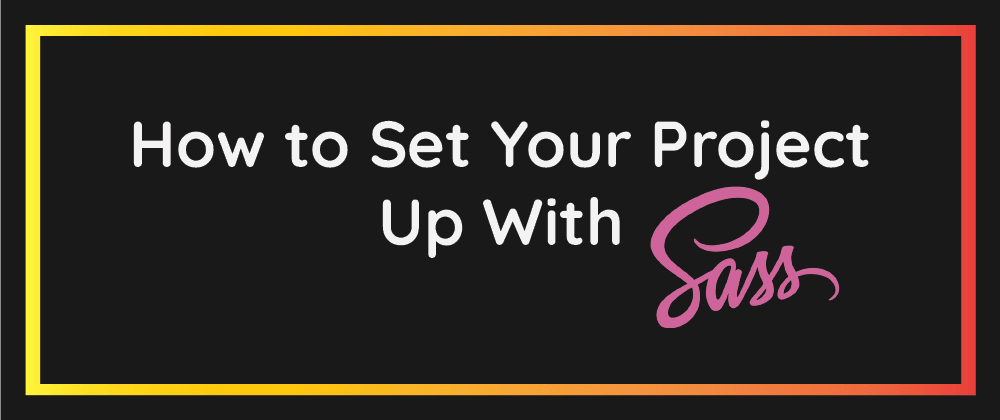

<p align="center">
 
</p>

## `SASS Project Setup`

## `Welcome`

Hello Everyone, I'm **`Sajib Bhattacharjee, A passionate Full-Stack Web-Developer`**, I want to welcome you to `SASS Project Setup ` - basics guideline for all.

#### `Configure User Setting.json file.`

```js

  "liveSassCompile.settings.generateMap": true,

  "liveSassCompile.settings.formats": [
    {
      "format": "expanded",
      "extensionName": ".css",
      "savePath": "/dist"
      //  "savePathReplacementPairs": null
    }
  ]

```

### `Collected By` - _`Sajib Bhattacharjee`_

---

<div 
align="center">

##### `All rights reserved by Sajib Bhattacharjee @2023`

### `Created By-->`

**&copy;`-Sajib Bhattacharjee`**

**`Dedicated for 💕"Zahan" 💕`**

> > > > ### Thanks A Lot For Visiting...!!!

</div>
